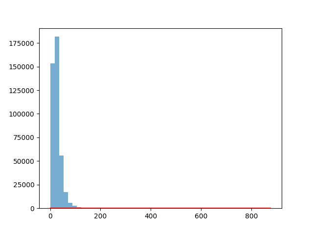
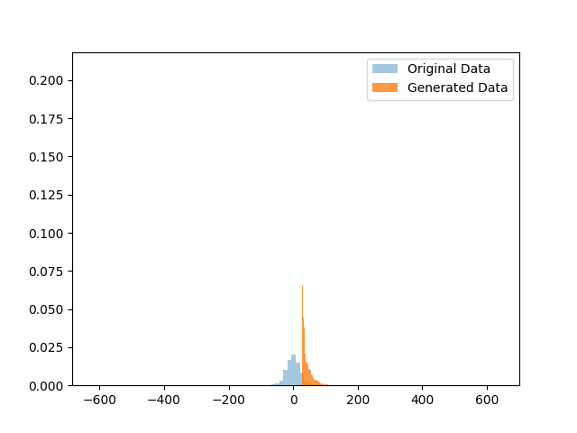

# Probability Density Function Prediction using GAN

## Overview

This project implements a **Generative Adversarial Network (GAN)** using PyTorch to learn and approximate the probability density function (PDF) of a transformed environmental variable.

The model is trained on a nonlinear transformation of nitrogen dioxide (`no2`) measurements from a dataset. After training, the generator produces synthetic samples that are compared to the original data distribution.

The dataset used is the **India Air Quality Data** from Kaggle. It contains air quality measurements across Indian cities.

Dataset Source:
[https://www.kaggle.com/datasets/shrutibhargava94/india-air-quality-data](https://www.kaggle.com/datasets/shrutibhargava94/india-air-quality-data)

## Data Transformation

```
target = (feature + alpha) * sin(beta * feature)
```

Where:

- `alpha = 0.5 * (roll_no % 7)`
- `beta  = 0.3 * (roll_no % 5 + 1)`
- `roll_no = 102303244`

The transformed target values are normalized using:

```
RobustScaler (sklearn)
```

Used to reduce sensitivity to outliers.

## Model Architecture

The project implements a standard GAN with:

### Generator

- Input: 1D Gaussian noise
- Architecture:
  - Linear (1 → 16)
  - ReLU
  - Linear (16 → 16)
  - ReLU
  - Linear (16 → 1)

- Output: Synthetic sample

### Discriminator

- Input: 1D sample
- Architecture:
  - Linear (1 → 16)
  - ReLU
  - Linear (16 → 16)
  - ReLU
  - Linear (16 → 1)
  - Sigmoid

- Output: Probability of being real

## Training Details

- Loss Function: Binary Cross Entropy Loss (`BCELoss`)
- Optimizer: Adam
- Learning Rate: 0.0005
- Batch Size: 64
- Epochs: 2000

## Output & Visualization

After training:

1. 10,000 synthetic samples are generated.
2. Data is inverse transformed to original scale.
3. Histograms are plotted:

### Estimated PDF



### Comparison Plot


